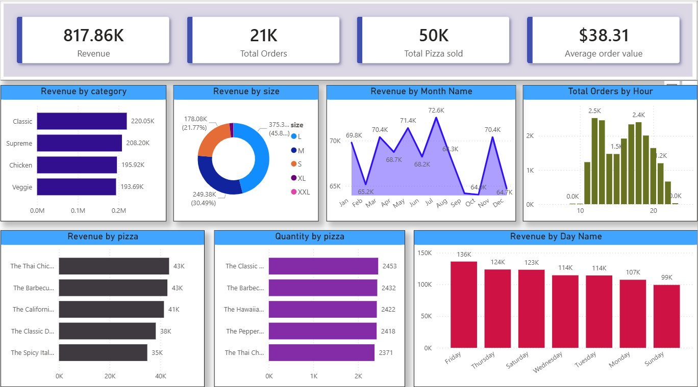

# 🍕 Pizza Sale Analysis — End-to-End SQL & Power BI Project

    

---

## 📌 Project Overview
This is an end-to-end data analytics project where I analyzed pizza sales data using **MySQL** and built an interactive dashboard using **Power BI**. The goal was to extract meaningful business insights from raw sales data to help a pizza business make smarter decisions.

---

## 🛠️ Tools & Technologies Used

| Tool | Purpose |
|---|---|
|  **MySQL** | Database creation & data storage |
|  **MySQL Workbench** | Writing & executing SQL queries |
|  **Power BI** | Interactive dashboard & visualization |

---

## 📊 Power BI Dashboard

---

## 🗃️ Database Schema
The project uses 4 tables:

| Table | Description |
|---|---|
| `orders` | Contains order_id, date and time of each order |
| `order_details` | Contains order details with pizza_id and quantity |
| `pizzas` | Contains pizza_id, size and price |
| `pizza_types` | Contains pizza name, category and ingredients |

---

## ❓ Business Questions Solved

### 🟢 Basic
1. Retrieve the total number of orders placed
2. Calculate the total revenue generated from pizza sales
3. Identify the highest-priced pizza
4. Identify the most common pizza size ordered
5. List the top 5 most ordered pizza types along with their quantities
6. What is the average order value (total revenue ÷ total orders)?

### 🟡 Intermediate
7. Join the necessary tables to find the total quantity of each pizza category ordered
8. Determine the distribution of orders by hour of the day
9. Join relevant tables to find the category-wise distribution of pizzas
10. Group the orders by date and calculate the average number of pizzas ordered per day
11. Determine the top 3 most ordered pizza types based on revenue

### 🔴 Advanced
12. Calculate the percentage contribution of each pizza type to total revenue
13. Analyze the cumulative revenue generated over time
14. Determine the top 3 most ordered pizza types based on revenue for each pizza category

---

## 💡 Key Business Insights

| Insight | Finding |
|---|---|
| 💰 Total Revenue | $817,860 |
| 🧾 Total Orders | 21,350 |
| 🍕 Total Pizzas Sold | 50,000+ |
| 💵 Avg Order Value | $38.31 |
| 🏆 Top Pizza by Revenue | The Thai Chicken Pizza |
| 📦 Top Pizza by Quantity | The Classic Deluxe Pizza |
| 🕛 Peak Hour | 12PM — 1PM |
| 📅 Busiest Day | Friday |
| 📏 Most Ordered Size | Large (L) |
| 🥇 Top Category | Classic |

---

## 📈 Power BI Dashboard Visuals
- 📌 KPI Cards — Revenue, Total Orders, Pizzas Sold, Avg Order Value
- 📊 Revenue by Category (Bar Chart)
- 🍩 Revenue by Pizza Size (Donut Chart)
- 🏆 Top 5 Pizzas by Revenue (Bar Chart)
- 📦 Top 5 Pizzas by Quantity (Bar Chart)
- 🕛 Orders by Hour (Bar Chart)
- 📅 Revenue by Day of Week (Bar Chart)
- 📈 Revenue by Month (Line Chart)

---

## 📁 Files in this Repository

| File | Description |
|---|---|
| `pizza_sale_sql.sql` | All SQL queries used in the project |
| `pizza_sale_dashboard.pbix` | Power BI dashboard file |
| `pizza_sale_dataset.zip` | Zipped folder containing all 4 CSV dataset files |
| `question.txt` | All business questions solved in this project |
| `dashboard.png` | Screenshot of the Power BI dashboard |

### 📦 Dataset (inside pizza_sale_dataset.zip)
| File | Description |
|---|---|
| `orders.csv` | Order id, date and time — 21,350 rows |
| `order_details.csv` | Pizza id and quantity per order — 48,620 rows |
| `pizzas.csv` | Pizza size and price — 96 rows |
| `pizza_types.csv` | Pizza name, category and ingredients — 32 rows |

---

## 🚀 How to Run
1. Download and unzip `pizza_sale_dataset.zip`
2. Import the 4 CSV files into MySQL Workbench
3. Run `pizza_sale_sql.sql` to execute all queries
4. Open `pizza_sale_dashboard.pbix` in Power BI Desktop
5. Connect to your local data source if needed

---

## 👤 Author
**Md. Tarakuzzaman Faysal**
- 🔗 LinkedIn: [linkedin.com/in/tfaysal](https://www.linkedin.com/in/tfaysal/)
- 🐙 GitHub: [github.com/iamfosu](https://github.com/iamfosu)

